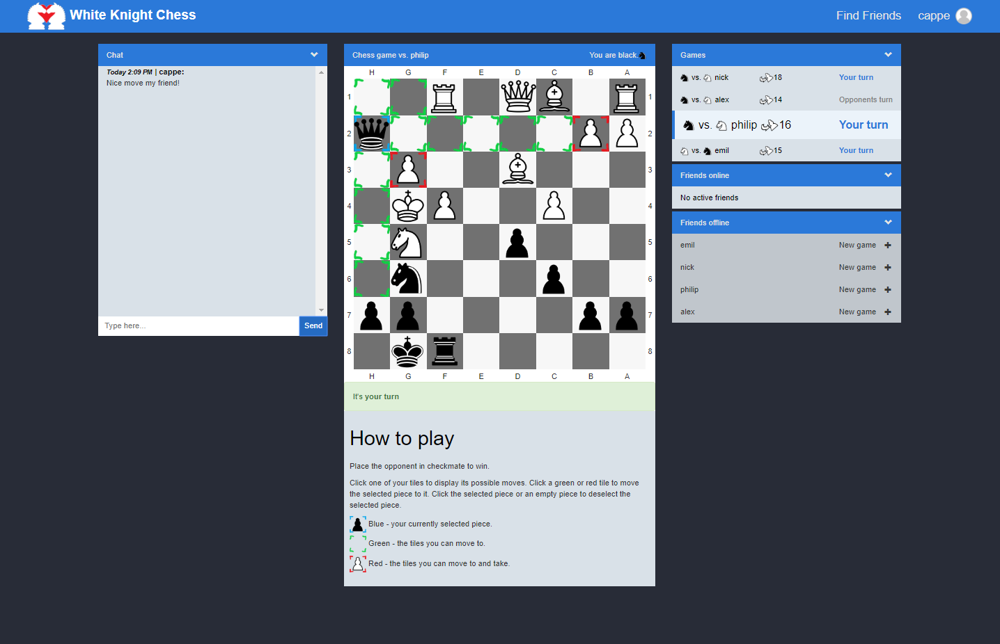
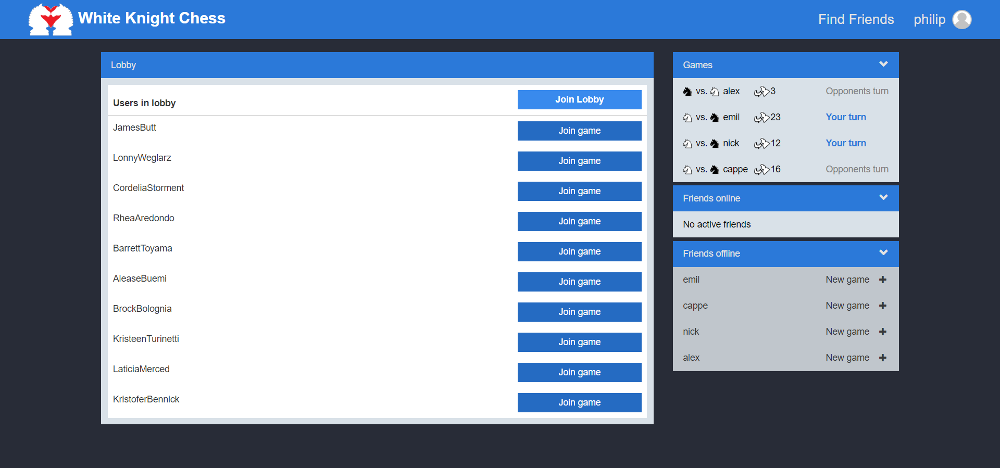
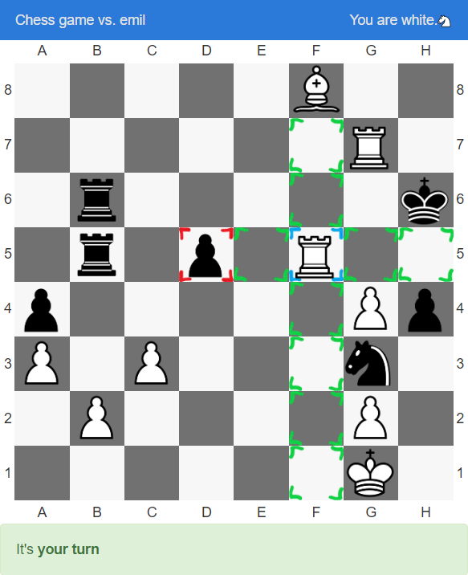
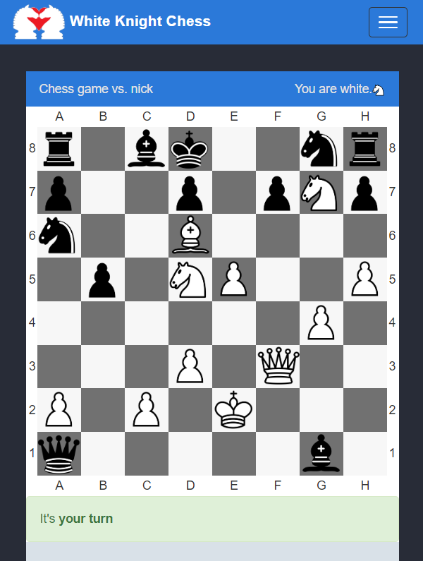
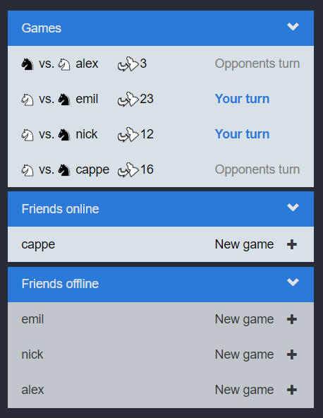

# White Knight Chess
White Knight Chess is a web application for playing chess against friends or other users. The application was developed for the course DVA231, Development of Web applications, at Mälardalen University. You can find more images [here](project-report/images) and you can find the project report [here](project-report/project-report.pdf)

# Dependencies
 - .NET Core 2.0
 - Entity Framework Core

It also makes use of Microsoft SQL server by default. If you want to run on a non-Windows computer you can change it in [this file](Norris.UI/Startup.cs) to use SQLite or any other supported database. The database is by default built and stored on the same machine as the server.

# The game view

# The lobby

# Playing the game

# Mobile view

# Sidebar 
